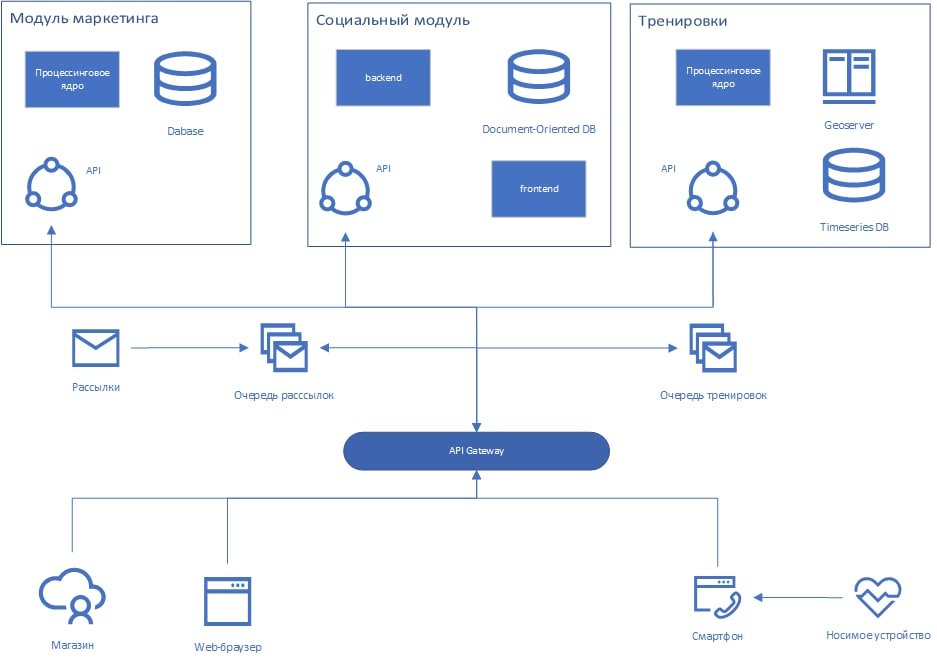

### Базовая архитектура с учётом ограничений бизнес-требований, НФТ, выбранной архитектуры, адресация атрибутов качества

Схема базовой архитектуры представлена ниже:

Как видно их схемы - основной входной точкой нашей системы является API Gateway. Данный компонент отвечает роутинг первоначальных запросов, а также за функции аутентификации и авторизации.

#### **Тренировки**

Предполагается, что для начала записи тренировки в пользователя на смартфоне должно быть установлено наше приложение. Данные о тренировочном процессе собираются подключенными носимыми устройствами (телефон, часами, нагрудным пульсометром и т.д.) и передаются в наше приложение. После окончания записи тренировки приложение передает запись на сервер, который кладет ее в специальную очередь. Модуль тренировок забирает запись из очереди и записывает в БД временных рядов [ADR: Выбор БД для модуля тренировок](../ADR/db_for_training_module.md). После записи процессинговый модуль сервера проводит ее обработку (расчеты различных показателей, сравнения, наложение координат на гео-сервер).

#### **Социальный модуль**

Социальный модуль состоит из следующих компонентов:
- backend - обеспечивает работу веб-интерфейса и приложения
- frontend - обеспечивает работу веб-интерфейса приложения, доступного из браузера
- Документоориентированная база данных, для хранения данных необходимых для работы backend модуля [ADR: Выбор БД для социального модуля](../ADR/db_for_social_module.md)

Пользователь обращает к API, на основе типа запроса (приложение или бразуер) запрос уходит либо на фронтэнд, либо сразу на бэкэнд. Если запрос подразумевает использование каких-то данных из сторонних модулей (тренировок или маркетинга) - бэкэнд через API делает запрос к API другого модуля. Так же можно кэшировать полученные данные.

#### **Модуль маркетинга**

Модуль маркетинга запрашивает через API данные из других модулей, загружает их в свою базу для анализа, и с помощью механизмов машинного обучения формирует таргетированные индивидуальные предложения для пользователей.

#### **Магазин**

Т.к. магазин не является частью нашей системы и представляет собой "черный ящик" - все необходимые взаимодействия с ним происходят через его API. Модули, которые хотят получить какие-либо данные из магазина делают соответствующие запросы к API магазина. Результаты запросов можно кэшировать

#### **Уведомления**

Push-up уведомления на приложения будут приходить с помощью Web-socket, или другого похожего механизма.
Рассылки писем будут осуществляться с помощью специальной утилиты, а также очереди. Модуль генерирует необходимое письмо и складывает ее в очередь на отправку. Утилита рассылки обрабатывает очередь по мере возможности.

