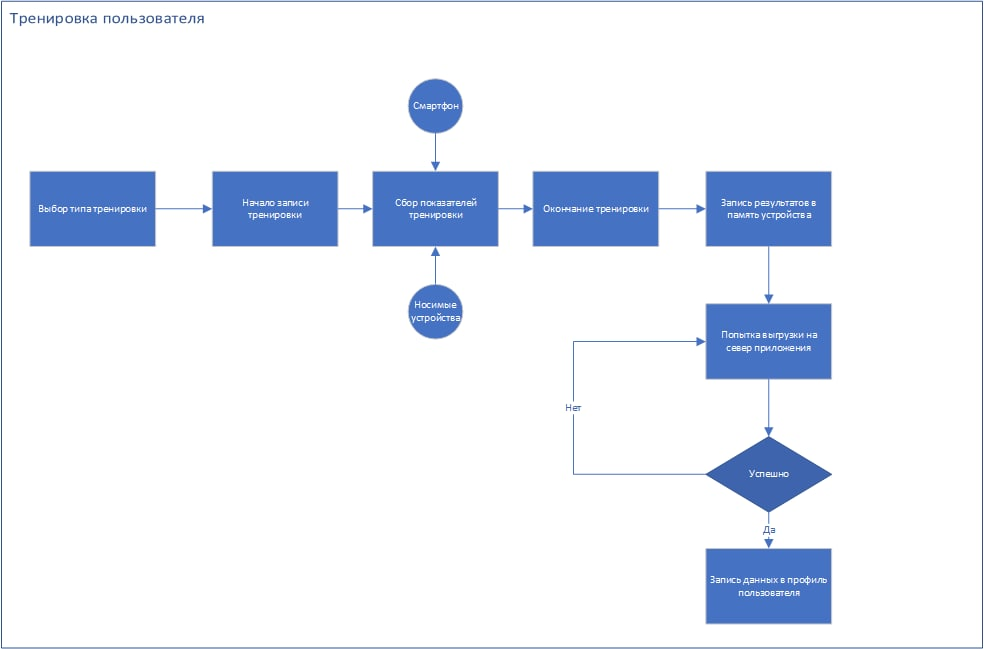
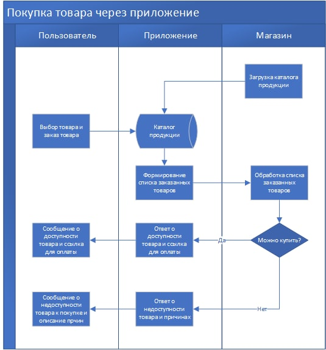
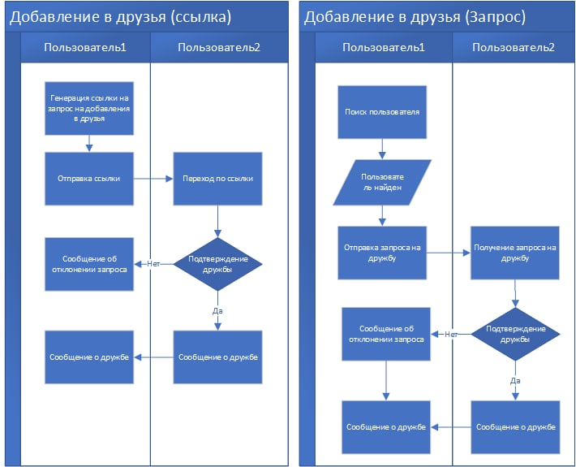

### Описание сценариев использования приложения

#### Сценарии использования приложения представлены ниже:

1. Запись тренировки

**Цель:** Целью данного сценария является фиксация и запись результатов тренировки пользователя.

**Описание:**
Пользователь открывает меню записи тренировки, выбирает нужный тип тренировки и нажимает **начать**. Система начинает фиксировать показатели тренировки пользователя, используя датчики на его смартфоне, а также датчики других носимых устройств, если такие подключены. После окончания тренировки, данные о ней записываются во временное хранилище на смартфоне пользователя, или на смарт-часах пользователя, если приложение было запущено с них. Далее система пытается выгрузить данные о тренировке с устройства пользователя в базу данных приложения. В случае успеха данные о тренировке попадают в личный профиль пользователя. Если по каким-то причинам данные о тренировке не удалось выгрузить на сервер нашего приложения - попытки выгрузи будут предприниматься далее до достижения успеха. (система будет автоматически пытаться выгрузить данные через следующие интервалы: 1, 5, 10, 30, 60, 400, 3600 минут. Так же будет доступна кнопка принудительной попытке выгрузки данных на сервер)

**Схема сценария записи тренировки представлена ниже:**

2. Покупка товара в приложении

**Цель:** целью данного сценария является покупка выбранного товара через наше приложение

**Описание:**
Каталог доступной к заказу продукции подгружается в приложение через API нашего магазина. Пользователь системы выбирает нудные ему продукты и нажимает кнопку "оформить заказ". Список объектов с идентификаторами товаров и их количеством через API передается в магазин. В магазине происходят все процессы связанные с проверкой возможности покупки данного товара (доступность на складе, возможность доставки и т.д.), если покупка возможна - клиенту через API высылается подтверждения бронирования заказа и ссылка на форму оплаты. В случае невозможности покупки выбранного товара, клиенту отправляется сообщение об ошибке, в котором указана причина.

**Схема сценария покупки товара пользователем через приложение**

3. Добавление пользователя в друзья

**Цель:** Добавление пользователя в друзья

**Описание:** Добавить пользователя в друзья можно двумя основными способами:
- По прямой ссылке от пользователя, который хочет подружиться
- Через форму поиска отправке запроса на добавление в друзья

В первом случае пользователь получает переходит по ссылке, подтверждает намерение подружиться и становиться другом пользователя

Во втором случае пользователь отправляет запрос за дружбу второму пользователю. Второй пользователь получает его и может либо подтвердить, либо отказаться. В случае подтверждения оба пользователя становятся друзьями, в случае отказа - первый пользователь получает сообщение о том, что второй отказался принять его дружбу.

**Схема процесса добавления в друзья:**

